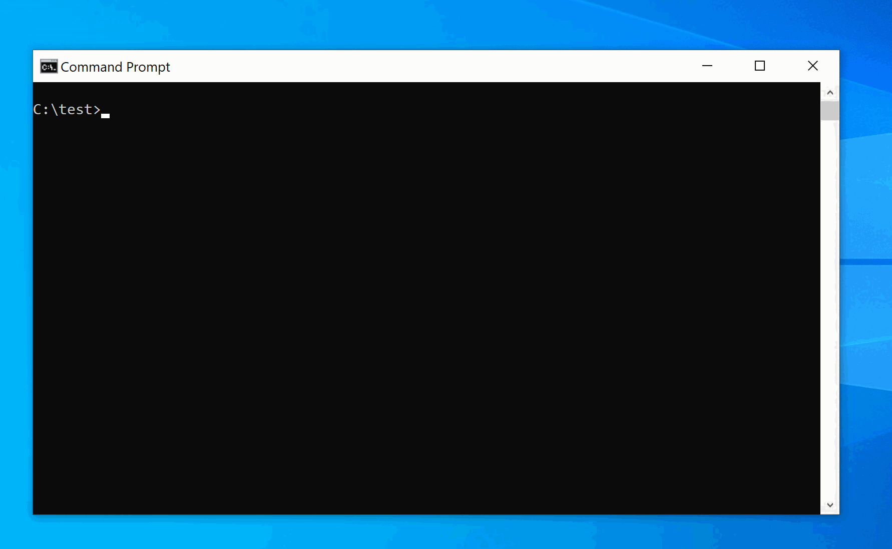

# gsudo - a sudo for Windows

[](https://gitter.im/gsudo/community?utm_source=badge&utm_medium=badge&utm_campaign=pr-badge&utm_content=badge)
[](https://ci.appveyor.com/project/gerardog/gsudo)

**gsudo** is a `sudo` equivalent for Windows, with a similar user-experience as the original *nix sudo.
It allows to run commands with elevated permissions, or to elevate the current shell, in the current console window or a new one.

Just prepend `gsudo` (or the `sudo` alias) to your command and it will run elevated. One UAC popup will appear each time. You can see less popups if you enable [gsudo cache](#credentials-cache).

**Why use `gsudo` instead of `some-other-sudo`?**

`gsudo` is very easy to install and use, and has more features. Its similarities with Unix/Linux sudo make the experience a breeze.

## Features

- Elevated commands are shown in the current user-level console. No new window. (Unless you specify `-n` which opens a new window.)
- [Credentials cache](#credentials-cache): `gsudo` can elevate many times showing only one UAC pop-up if the user opt-in to enable the cache.
- Supports CMD commands: `gsudo md folder` (no need to use the longer form `gsudo cmd.exe /c md folder`)
- Supports [PowerShell/PowerShell Core commands](#usage-from-powershell--powershell-core), and Yori shell.
- Supports being used on scripts:
  - Outputs of the elevated commands can be interpreted: E.g. StdOut/StdErr can be piped or captured (e.g. `gsudo dir | findstr /c:"bytes free" > FreeSpace.txt`) and exit codes too (`%errorlevel%`). If `gsudo` fails to elevate, the exit code will be 999.
  - If `gsudo` is invoked from an already elevated console, it will just run the command (it won't fail). So, you don't have to worry if you run `gsudo` or a script that uses `gsudo` from an already elevated console. (The UAC popup will not appear, as no elevation is required)

## Installation

* Using [Scoop](https://scoop.sh): `scoop install gsudo`
* Or using [Chocolatey](https://chocolatey.org/install):  `choco install gsudo`
* Or using [WinGet](https://github.com/microsoft/winget-cli/releases) `winget install gsudo`
* Or manually: Unzip the latest release, and add to the path. Or let the following script do it for you:
``` batch
PowerShell -Command "Set-ExecutionPolicy RemoteSigned -scope Process; iwr -useb https://raw.githubusercontent.com/gerardog/gsudo/master/installgsudo.ps1 | iex"
```

Note: gsudo is portable. No windows service is required or system change is done, except adding gsudo to the Path.

## Usage

```gsudo```  Opens an elevated shell in the current console.

```gsudo [options] {command} [arguments]```
Executes the specified command with elevated permissions.

Most relevant **`[options]`**:

- **`-n | --new`**        Starts the command in a **new** console with elevated rights (and returns immediately).
- **`-w | --wait`**       Force wait for the process to end (and return the exitcode).
- **`-s | --system`**     Run As Local System account ("NT AUTHORITY\SYSTEM").
- **`-i | --integrity {v}`**   Run command with a specific integrity level: `Low`, `Medium`, `MediumPlus`, `High` (default), `System`. For example, use `Low` to launch a restricted process, or use `Medium` from an Admin/Elevated window to run without Admin rights. 
- **`--copyns `**         Reconnect current connected network shares on the elevated session. Warning! This is verbose, affects the elevated user system-wide (other processes), and can prompt for credentials interactively.
- **`--debug `**          Debug mode (verbose).

```gsudo config```
Show current user-settings.

```gsudo config {key} ["value" | --reset]```
Read, write, or reset a user setting to the default value.

```gsudo status```
Show status information about current user, security, integrity level or other gsudo relevant data.

**Note:** You can use anywhere **the `sudo` alias** created by the installers.

**Examples:**

``` batch
# elevate the current shell in the current console window (Cmd/PowerShell/Pwsh Core/Yori)
gsudo

# launch the current shell elevated in a new console window
gsudo -n

# launch in new window and wait for exit
gsudo -n -w powershell ./Do-Something.ps1

# launch windows app
gsudo notepad %windir%\system32\drivers\etc\hosts
# launch windows app and wait for exit
gsudo -w notepad %windir%\system32\drivers\etc\hosts

# sudo alias built-in with choco/scoop/manual installers: 
sudo notepad %windir%\system32\drivers\etc\hosts

# Cmd Commands:
gsudo type MySecretFile.txt
gsudo md "C:\Program Files\MyApp"

# redirect/pipe input/output/error
gsudo dir | findstr /c:"bytes free" > FreeSpace.txt

# Configure Reduced logging
gsudo config LogLevel "Error"
# Configure a custom Elevated Prompt
gsudo config Prompt "$P [elevated]$G "
# Reset Elevated Prompt config to default value
gsudo config Prompt --reset
# Enable credentials cache (less UAC popups):
gsudo config CacheMode Auto
```

### Usage from PowerShell / PowerShell Core

`gsudo` detects if it's invoked from PowerShell and allows the following syntax to elevate PS commands: You can **pass a string literal** with the command that needs to be elevated. [PowerShell Quoting Rules](https://docs.microsoft.com/en-us/powershell/module/microsoft.powershell.core/about/about_quoting_rules) apply. 
Note that `gsudo` returns a string that can be captured, not powershell objects.

`PS C:\> gsudo 'powershell string command'`

**Examples:**

``` PowerShell

# Commands without () or quotes  
PS C:\> gsudo Remove-Item ProtectedFile.txt
or
PS C:\> gsudo 'Remove-Item ProtectedFile.txt'

# On strings enclosed in single quotation marks ('), escape " with \"
$hash = gsudo '(Get-FileHash \"C:\My Secret.txt\").Hash'
# For variable substitutions, use double-quoted strings with single-quotation marks inside
$hash = gsudo "(Get-FileHash '$file' -Algorithm $algorithm).Hash"
# or escape " with \""
$hash = gsudo "(Get-FileHash \""$file\"" -Algorithm $algorithm).Hash"

# Test gsudo success (optional):
if ($LastExitCode -eq 999 ) {
    'gsudo failed to elevate!'
} elseif ($LastExitCode) {
    'Command failed!'
} else { 'Success!' }
```

### Usage from WSL (Windows Subsystem for Linux)

On WSL, elevation and `root` are different concepts. WSL is a user application,`root` allows full administation of WSL but not the windows system. Use WSL's native `su` or `sudo` to gain `root` access. To get admin priviledge on the Windows box you need to elevate the WSL process. `gsudo.exe` allows that (UAC popup will appear).

Use `gsudo.exe` or `sudo.exe` alias...(add `.exe`)

``` bash
# elevate default shell
PC:~$ gsudo.exe wsl

# run elevated Linux command
PC:~$ gsudo.exe wsl -e mkdir /mnt/c/Windows/MyFolder

# run elevated Windows command
PC:~$ gsudo.exe notepad C:/Windows/System32/drivers/etc/hosts
PC:~$ gsudo.exe "notepad C:\Windows\System32\drivers\etc\hosts"
gsudo.exe cmd /c "echo 127.0.0.1 www.MyWeb.com >> %windir%\System32\drivers\etc\hosts"

# test for gsudo and command success
retval=$?;
if [ $retval -eq 0 ]; then
    echo "Success";
elif [ $retval -eq $((999 % 256)) ]; then # gsudo failure exit code (999) is read as 231 on wsl (999 mod 256)
    echo "gsudo failed to elevate!";
else
    echo "Command failed with exit code $retval";
fi;
```

## Credentials Cache

The `Credentials Cache` allows to elevate several times from a parent process with only one UAC pop-up. To enable this feature use: `gsudo config CacheMode auto`

It is convenient, but it's safe only if you are not already hosting a virus/malicious process: As the cache allows your process to elevate again silently (no-popup),  a malicious process could [inject it's code](https://en.wikipedia.org/wiki/DLL_injection#Approaches_on_Microsoft_Windows) into the allowed process and trick `gsudo` to elevate with no popup.

Available Cache Modes:

The cache mode can be set with **`gsudo config CacheMode auto|explicit|disabled`**

- Auto: Simil-unix-sudo. The first elevation shows a UAC Popup and starts a cache session automatically.
- Explicit: (default) Every elevation shows a UAC popup, unless a cache session is started explictly with `gsudo cache on`.
- Disabled: Every elevation request shows a UAC popup.

An active credentials cache session is just an elevated instance of gsudo that stays running and allows the invoker process to elevate again. No windows service or setup involved.

Use `gsudo cache on|off` to start/stop a cache session manually (i.e. allow/disallow elevation of the current process with no additionals UAC popups).

Use `gsudo -k` to terminate all cache sessions. (Use this before leaving your computer unattended to someone else.) 

The cache session ends automatically when the allowed process ends or if no elevations requests are received for 5 minutes (configurable via `gsudo config CacheDuration`).

## Demo

(with CacheMode=Auto)


## Known issues

- Under some circumstances the `sudo` alias can misbehave while the `gsudo` command works well. Please file an issue to let me know.

- The elevated instances do not have access to the network shares connected on the non-elevated space. This is not a `gsudo` issue but how Windows works. Use `--copyNS` to replicate Network Shares into the elevated session, but this is not bi-directional and it's interactive (may prompt for user/password).

- Given the previous item, `gsudo.exe` can be placed on a network share and invoked as `\\server\share\gsudo {command}` but doesn't work if your current folder is a network drive. For example do not map `\\server\share\` to `Z:` and then `Z:\>gsudo do-something`.  

- Please report issues in the [Issues](https://github.com/gerardog/gsudo/issues) section.

## FAQ

- Why is it named `gsudo` instead of just `sudo`?

  When I created `gsudo`, there were other `sudo` packages on most Windows popular package managers such as `Chocolatey` and `Scoop`, so I had no other choice to pick another name. `gsudo` installers create an alias for `sudo`, so feel free to use `sudo` on your command line to invoke `gsudo`.

- Why `.Net Framework 4.6`?

  Because 4.6 is included in every Windows 10 installation. `.Net Core` requires additional installation steps and provides no substantial benefit since `gsudo` is Windows-specific. (Other platforms can use the standard *nix sudo.)

- Is `gsudo` a port of `*nix sudo`?

  No. `gsudo` reminds of the original sudo regarding user expectations. Many `sudo` features are `*nix` specific and could never have a `Windows` counterpart. Other features (such as `sudoers`) could potentially be implemented but are not at this point.

- Does it work in Windows Vista/7/8?

  Almost: The elevation works, but the credentials cache and the special colored elevated prompt fails. The hardest part is to install `.NET 4.6` there. Try `choco install dotnetfx` and `gsudo config Prompt "$P# "`.

- How do I return to the previous security level after using gsudo?

  In the same way as you would with `Unix/Linux sudo`: `gsudo` does not alter the current process, instead it launches a new process with different permissions/integrity level. To go back to the previous level, just end the new process. For `Command Prompt` or `PowerShell` just type `exit`.
