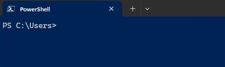

# gsudo - a sudo for Windows

[](https://gitter.im/gsudo/community?utm_source=badge&utm_medium=badge&utm_campaign=pr-badge&utm_content=badge)
[](../../actions/workflows/ci.yml)
[](https://community.chocolatey.org/packages/gsudo)
[](https://github.com/gerardog/gsudo/releases/latest)

**gsudo** is a `sudo` equivalent for Windows, with a similar user-experience as the original Unix/Linux sudo.
Allows you to run a command (or re-launch your current shell) with elevated permissions, in the current console window or a new one.
 
Just [prepend `gsudo`](#usage) (or the `sudo` alias) to your command and it will run elevated. For PowerShell use this [syntax](#usage-from-powershell--powershell-core): `gsudo { ScriptBlock }`

One UAC popup will appear each time. You can see less popups if you enable [gsudo cache](#credentials-cache).

It detects your current shell and elevates your command as native shell commands. (Supports `Cmd`, `PowerShell`, `WSL`, `git-bash`, `MinGW`, `Cygwin`, `Yori`, `Take Command`, `BusyBox` & `NuShell`.) 

## Table of contents

- [gsudo - a sudo for Windows](#gsudo---a-sudo-for-windows)
  - [Table of contents](#table-of-contents)
  - [Demo](#demo)
  - [Features](#features)
  - [Installation](#installation)
  - [Usage](#usage)
    - [Usage from PowerShell / PowerShell Core](#usage-from-powershell--powershell-core)
      - [PowerShell Module](#powershell-module)
    - [Usage from WSL (Windows Subsystem for Linux)](#usage-from-wsl-windows-subsystem-for-linux)
  - [Configuration](#configuration)
  - [Credentials Cache](#credentials-cache)
  - [Known issues](#known-issues)
  - [FAQ](#faq)
  - [Please support gsudo! 💵](#please-support-gsudo-)

---

⭐ Extended documentation available at: [<https://gerardog.github.io/gsudo/>](https://gerardog.github.io/gsudo/docs/intro)

## Demo


(with `gsudo config CacheMode auto`)

---

## Features

- Elevated commands are shown in the current console. No new window (unless you specify `-n`)
- [Credentials cache](#credentials-cache): `gsudo` can elevate many times showing only one UAC pop-up if the user opts-in to enable the cache.
- Detects your current shell (Supports [`CMD`](#usage), [`PowerShell`](#usage-from-powershell--powershell-core), [`WSL`](#usage-from-wsl-windows-subsystem-for-linux), `Bash for Windows` (Git-Bash/MinGW/MSYS2/Cygwin), `Yori`, `Take Command` and `NuShell`), and elevates your command correctly.

- Supports being used on scripts:
  - Outputs StdOut/StdErr can be piped or captured (e.g. `gsudo dir | findstr /c:"bytes free" > FreeSpace.txt`) and exit codes too (`%errorlevel%`). If `gsudo` fails to elevate, the exit code will be 999.
  - If `gsudo` is invoked from an already elevated console, it will just run the command (it won't fail). So, you don't have to worry if you run `gsudo` or a script that uses `gsudo` from an already elevated console. (The UAC popup will not appear, as no elevation is required)
  
- `gsudo !!` elevates the last executed command. Works on CMD, Git-Bash, MinGW, Cygwin (and PowerShell with [gsudo module](#gsudomodule) only)

## Installation

- Using [Scoop](https://scoop.sh): `scoop install gsudo`
- Using [WinGet](https://github.com/microsoft/winget-cli/releases): `winget install gerardog.gsudo`
- Using [Chocolatey](https://chocolatey.org/install):  `choco install gsudo`
- Running this line: [(script)](installgsudo.ps1):
  ``` PowerShell
  PowerShell -Command "Set-ExecutionPolicy RemoteSigned -scope Process; [Net.ServicePointManager]::SecurityProtocol = 'Tls12'; iwr -useb https://raw.githubusercontent.com/gerardog/gsudo/master/installgsudo.ps1 | iex"
  ```
- Portable: 
  1. Download `gsudo.portable.zip` from the [latest release](https://github.com/gerardog/gsudo/releases/latest)
  2. Extract the folder corresponding to your processor architecture (x64, x86, or arm64) from the zip file to a suitable directory on your computer.
  3. Optionally, add that directory to your system's PATH environment variable if it's not already accessible.
  
**Please restart all your console windows** after installing to ensure that the `PATH` environment variable is refreshed.

Note: `gsudo.exe` is portable. No windows service is required or system change is done, except adding it to the Path.

## Usage

``` powershell
gsudo [options]                  # Starts your current shell elevated
gsudo [options] {command} [args] # Runs {command} with elevated permissions
gsudo cache [on | off | help]    # Starts/Stops a credentials cache session. (less UAC popups)
gsudo status [--json | filter ]  # Shows current user, cache and console status.
gsudo !!                         # Re-run last command as admin. (YMMV)
```

``` powershell
New Window options:
 -n | --new            # Starts the command in a new console/window (and returns immediately).
 -w | --wait           # When in new console, wait for the command to end.
 --keepShell           # After running a command, keep the elevated shell open.
 --keepWindow          # After running a command in a new console, ask for keypress before closing the console/window.

Security options:
 -u | --user {usr}     # Run as the specified user. Asks for password. For local admins shows UAC unless '-i Medium'
 -i | --integrity {v}  # Specify integrity level: Untrusted, Low, Medium, MediumPlus, High (default), System
 -s | --system         # Run as Local System account (NT AUTHORITY\SYSTEM).
 --ti                  # Run as member of NT SERVICE\TrustedInstaller
 -k                    # Kills all cached credentials. The next time gsudo is run a UAC popup will be appear.

Shell related options:
 -d | --direct         # Skips Shell detection. Assume CMD shell or CMD {command}.
 --loadProfile         # When elevating PowerShell commands, load user profile.

Other options:
 --loglevel {val}      # Set minimum log level to display: All, Debug, Info, Warning, Error, None
 --debug               # Enable debug mode.
 --copyns              # Connect network drives to the elevated user. Warning: Verbose, interactive asks for credentials
 --copyev              # (deprecated) Copy environment variables to the elevated process. (not needed on default console mode)
 --chdir {dir}         # Change the current directory to {dir} before running the command.
```

**Note:** You can use anywhere **the `sudo` alias** created by the installers.

**Examples:**

``` powershell
gsudo   # elevates the current shell in the current console window (Supports Cmd/PowerShell/Pwsh Core/Yori/Take Command/git-bash/cygwin)
gsudo -n # launch the current shell elevated in a new console window
gsudo -n -w powershell ./Do-Something.ps1 # launch in new window and wait for exit
gsudo notepad %windir%\system32\drivers\etc\hosts # launch windows app

sudo notepad # sudo alias built-in

# redirect/pipe input/output/error example
gsudo dir | findstr /c:"bytes free" > FreeSpace.txt

gsudo config LogLevel "Error"          # Configure Reduced logging
gsudo config Prompt "$P [elevated]$G " # Configure a custom Elevated Prompt
gsudo config Prompt --reset            # Reset to default value

# Enable credentials cache (less UAC popups):
gsudo config CacheMode Auto
```

### Usage from PowerShell / PowerShell Core

`gsudo` detects if invoked from PowerShell and elevates PS commands (unless `-d` is used to elevate CMD commands).

The command to elevate will run in a different process, so it **can't access the parent `$variables` and scope.**

To elevate a commands or script block: **Wrap it in {curly braces}**.
   ``` powershell
   # Syntax:
   gsudo { ScriptBlock }
   gsudo [options] { ScriptBlock } [-args $argument1[..., $argumentN]] ;

   # Examples:
   gsudo { Write-Output "Hello World" }

   # Pass arguments with -args
   $MyString = "Hello World"
   gsudo { Write-Output $args[0] } -args $MyString  

   # Output is serialized as PSObjects with properties.
   $services = gsudo { Get-Service 'WSearch', 'Winmgmt'} 
   Write-Output $services.DisplayName

   # Inputs too: Example elevated iteration of a list.
   Get-ChildItem . | gsudo { $Input.CreationTime}
   ```

Alternative syntaxes:
<details>
  <summary>2. Invoke-gsudo wrapper function: (much slower)</summary>

   ``` powershell
   # Pass values (not variables by reference) by prefixing `$using:`. I.E.

   $MyString = "Hello World"
   Invoke-Gsudo { Write-Output $using:MyString }  

   # Syntax:
   Invoke-Gsudo [-ScriptBlock] <ScriptBlock> 
                [[-ArgumentList] <Object[]>] 
                [-InputObject <PSObject>] 
                [-LoadProfile | -NoProfile] 
                [-Credential <PSCredential>]
   ```

    - PowerShell function.
    - Performs auto serialization of inputs & outputs. 
    - You can prefix variables with the `$using:` scope modifier (like `$using:variableName`) and their serialized value is applied.
    - Use `-LoadProfile` or `-NoProfile` to override profile loading or not.
    - Use `-Credential` option for Run As User (same as `-u` but for `Get-Credentials`).
    - Better forwarding of your current context to the elevated instance (current Location, $ErrorActionPreference)
</details>

<details>
  <summary>3. Manual string interpolation. (not recommended) </summary>
  I don't recommend this approach as it is really hard to do proper escape all special characters. 

   ``` PowerShell
   Usage: gsudo 'string literal'

   # Variable substitutions example:
   $file='C:\My Secret.txt'; 
   $algorithm='md5';
   $hash = gsudo "(Get-FileHash '$file' -Algorithm $algorithm).Hash"
   # or 
   $hash = gsudo "(Get-FileHash ""$file"" -Algorithm $algorithm).Hash"
   ```

   - Accepts a string literal with the command to elevate.
   - Returns a list of strings.
</details>

#### PowerShell Module

- <a name="gsudomodule"></a> Optional: Import module `gsudoModule.psd1` into your PowerShell Profile:
  - Adds syntax auto-complete to gsudo in PowerShell. Plus, it suggests the 3 previous commands, making your workflow smoother than ever!
  - Enables `gsudo !!` on Powershell, to elevate the last executed command.
  - Adds Functions: 
    - `Test-IsGsudoCacheAvailable` Returns true if a gsudo cache is active (meaning elevation with no UAC is possible).
    - `Test-IsProcessElevated`: Returns true if the current process is elevated.
    - `Test-IsAdminMember`: Returns true if the current user is member of the `Local Administrators` groups, which means it can elevate with.
  
  ``` Powershell
  # Add the following line to your $PROFILE 
  Import-Module "gsudoModule"

  # Or run:
  Write-Output "`nImport-Module `"gsudoModule`"" | Add-Content $PROFILE
  ```

  - If you haven't already customized your PowerShell prompt (for example by installing Oh-My-Posh), you can easily add a red `#` indicating that the current process is elevated:
    
  
  To do so add this line to your profile (after importing `gsudoModule`):
  
  ``` powershell
  Set-Alias Prompt gsudoPrompt
  ``` 
---

### Usage from WSL (Windows Subsystem for Linux)

On WSL, elevation and `root` are different concepts. `root` allows full administration of WSL but not the windows system. Use WSL's native `su` or `sudo` to gain `root` access. To get admin privilege on the Windows box you need to elevate the WSL.EXE process. `gsudo` allows that (a UAC popup will appear).

On WSL bash, prepend `gsudo` to elevate **WSL commands** or `gsudo -d` for **CMD commands**.

``` bash
# elevate default shell
PC:~$ gsudo 

# run elevated WSL command
PC:~$ gsudo mkdir /mnt/c/Windows/MyFolder

# run elevated Windows command
PC:~$ gsudo -d notepad C:/Windows/System32/drivers/etc/hosts
PC:~$ gsudo -d "notepad C:\Windows\System32\drivers\etc\hosts"

# test for gsudo and command success
retval=$?;
if [ $retval -eq 0 ]; then
    echo "Success";
elif [ $retval -eq $((999 % 256)) ]; then # gsudo failure exit code (999) is read as 231 on wsl (999 mod 256)
    echo "gsudo failed to elevate!";
else
    echo "Command failed with exit code $retval";
fi;
```

## Configuration

``` powershell
 gsudo config                          # Show current config settings & values.
 gsudo config {key} [--global] [value] # Read or write a user setting
 gsudo config {key} [--global] --reset # Reset config to default value
 --global                              # Affects all users (overrides user settings)
```

## Credentials Cache

The `Credentials Cache`, if enabled and active, allows to elevate several times from a parent process with only one UAC pop-up. After 5 minutes without elevations, the cache session closes automatically (Configurable timeout via `gsudo config CacheDuration`).

While this  very convenient, it's important to understand its potential security risks. Even if gsudo itself is secure, the inherent vulnerability lies in the host process. If your system is already compromised by a malicious process, it can manipulate the permitted process (e.g., Cmd/Powershell) and force an active gsudo cache instance to elevate privileges without triggering a UAC prompt.

This risk is the trade-off for using the Credentials Cache. The cache is safe to use as long as you are confident there are no malicious processes running on your system.

Here are the `Credentials Cache` Modes:
- `Explicit:` (default) Every elevation shows a UAC popup, unless a cache session is started manually...
  - To start or stop a cache session run: `gsudo cache {on | off}`
  - This is the default mode. (Use `gsudo config CacheMode Explicit` to revert to this value).
- `Auto:` Similar to unix-sudo. The first elevation shows a UAC popup and **starts a cache session automatically**.
  - Run `gsudo config CacheMode Auto` to use this mode.
- `Disabled:` Every elevation shows a UAC popup, and trying to start a cache session will throw an error..
  - Run `gsudo config CacheMode Disabled` to use this mode.

In any case, you can stop all cache sessions with `gsudo -k`.

[Learn more](https://gerardog.github.io/gsudo/docs/credentials-cache)

## Known issues

- The elevated instances do not have access to the network shares connected on the non-elevated space. This is not a `gsudo` issue but how Windows works. Use `--copyNS` to replicate Network Shares into the elevated session, but this is not bi-directional and is interactive (may prompt for user/password).

- `gsudo.exe` can be placed on a network share and invoked as `\\server\share\gsudo {command}` but doesn't work if your **current** folder is a network drive. For example do not map `\\server\share\` to `Z:` and then `Z:\>gsudo do-something`.

- Please report issues in the [Issues](https://github.com/gerardog/gsudo/issues) section.

## FAQ

- Why is it named `gsudo` instead of just `sudo`?

  When I created `gsudo`, there were other `sudo` packages on most Windows popular package managers such as `Chocolatey` and `Scoop`, so I had no other choice to pick another name. `gsudo` installers create an alias for `sudo`, so feel free to use `sudo` on your command line to invoke `gsudo`.

- Why did you migrated from `.Net Framework 4.6` to `.Net Core 7.0`?

  Starting from v1.4.0, it is built using `.Net 7.0` NativeAOT. It loads faster and uses less memory, and runs on machines without any .Net runtime installed. Prior versions `<v1.3.0` used .Net 4.6, because it was included in every Windows 10/11 installation.

- Is `gsudo` a port of `*nix sudo`?

  No. `gsudo` reminds of the original sudo regarding user expectations. Many `sudo` features are `*nix` specific and could never have a `Windows` counterpart. Other features (such as `sudoers`) could potentially be implemented but are not at this point.

- What are the requirements? Does it work in Windows 7/8?

  It works on Win7 SP1 onwards. Some features may only work in Windows 10/11, like elevating as TrustedInstaller.

- How do I return to the previous security level after using gsudo?

  In the same way as you would with `Unix/Linux sudo`: `gsudo` does not alter the current process, instead it launches a new process with different permissions/integrity level. To go back to the previous level, just end the new process. For `Command Prompt` or `PowerShell` just type `exit`.

## Please support gsudo! 💵

- Please give us a star! ⭐
- Help spread the word by mentioning `gsudo` in social networks!
- [Sponsor or Donate](https://gerardog.github.io/gsudo/sponsor)
