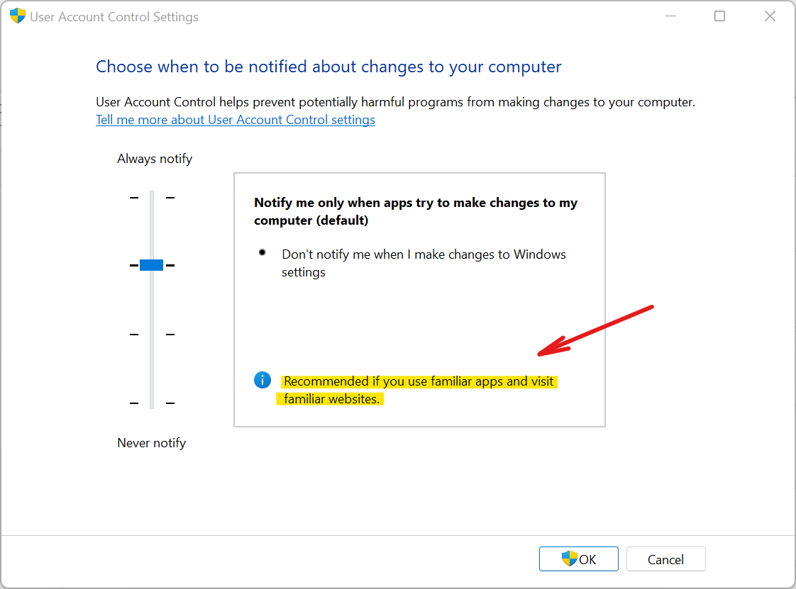

## Why Windows doesn't have a `sudo` command? Should it have one?

To answer this question, we first have to take a look back at the history.

In August 2002, Chris Paget released a white paper describing a form of attack against event-driven systems that he termed Shatter Attack. It allowed processes in the same session to bypass security restrictions by abusing Windows Message loop.

Microsoft response was to add "User Interface Privilege Isolation" (UIPI) and the "User Access Control" (UAC) popup to the next major release: Windows Vista. Privileged processes would then run "elevated" at high integrity level, out of reach of processes at lower, non-admin, levels.

I assume that at this point Microsoft decided not to make a `sudo` tool for windows. It would be an unwanted bridge between two worlds that intended to isolate.

But that insulation quickly proved weak. Let me [quote Raymond Chen from Microsoft](https://devblogs.microsoft.com/oldnewthing/20160816-00/?p=94105):

> There’s a setting that lets you specify how often you want to be prompted by UAC. You can set any of four levels:
>
> - Always notify
> - Notify only when apps try to change settings, use the secure desktop `(Default mode)`
> - Notify only when apps try to change settings, don’t use the secure desktop
> - Never notify
>
> Although it looks like there are four settings, in a theoretical sense, there really are only two settings.
>
> - Always notify
> - Meh
>
> The reason why all the other options collapse into Meh is that the `Notify only when apps try to change settings` option can be subverted by any app simply by injecting a thread into (...)

And, up to this day, Windows 10 & 11, defaults to "Meh". Microsoft default is: lesser security at the expense of user convenience.

---

[Windows 11 UAC Settings: Default mode is recommended only if you **don't** run untrusted software.]

---

Over time, no less than a hundred UAC-bypass techniques were disclosed. Many of them still work in an updated Windows 11. Windows Defender, or your antivirus of choice, will stop them (hopefully). But if you disable your AV, UAC bypass is easy.

Microsoft did not patch them. Instead, they assumed publicly that `UAC/UIPI` in default mode is not a security boundary. I will [quote Microsoft documentation](https://docs.microsoft.com/en-us/troubleshoot/windows-server/windows-security/disable-user-account-control#:~:text=More%20important%2C%20Same%2Ddesktop%20Elevation,be%20considered%20a%20convenience%20feature.) :

> Same-desktop Elevation in UAC isn't a security boundary. It can be hijacked by unprivileged software that runs on the same desktop. Same-desktop Elevation should be considered a convenience feature.

Which means: <b>UAC does not protect you from threats. It's a convenience tool that protects you from shooting yourself in the foot. </b>

And, in my opinion, it's not doing the best possible job:

- You waste important time by switching between elevated and unelevated windows. You must manually carry your command and context to the elevated window, each time, back and forth.
- ... or you suffer from "elevation fatigue". For example, you elevate a whole console beforehand, and you do all your stuff there, likely running non-admin or untrusted stuff as admin.

**In conclusion:** 

- Same-desktop UAC is a vulnerable convenience feature, and so is `gsudo`. In any case, **the only thing that protects you from malware is you and your Antivirus.**.

## What are the risks of running gsudo?

gsudo could be used as an attack vector for escalation of privileges. Using antivirus software and avoiding running untrusted software

- **Abusing an elevation made with gsudo:**
  
  A medium integrity process could drive the gsudo-elevated process. 
  
  When gsudo elevates **in the same console**, it creates a connection between a medium and a high integrity process. A malicious process (at medium integrity) can then drive the medium integrity console: sending keystrokes to the high integrity app, or scrapping its screen.
  
  In my opinion, this is a mild risk that you are already exposed when using UAC in default mode. In the end, your only protection is your AV.

  Ways to avoid this risk:
  - Elevating on a new console either per-command (using `-n`/`--new`) or force it using [config setting `NewWindow.Force`](tips/elevation-in-new-window.md).
  - Experimental setting `SecurityEnforceUacIsolation`:
  makes the elevated command run redirected, w/input redirected to `NULL`. Hence it will be non-interactive, so nobody will be able to drive it. Enable with `gsudo config SecurityEnforceUacIsolation true`

- **Abusing an active `gsudo's Credentials Cache` to elevate a process silently**:

   The `Credentials Cache` allows many elevations with only one UAC popup. But there is a reason why the cache is disabled by default.

   When the cache is active, it allows elevation from one invoker process and its children, which are running at the unprotected medium integrity level. A malicious process also at medium level can inject it's code into an allowed process and make it call gsudo to request elevation silently.

   You avoid this risk by default, by not enabling the credentials cache.
